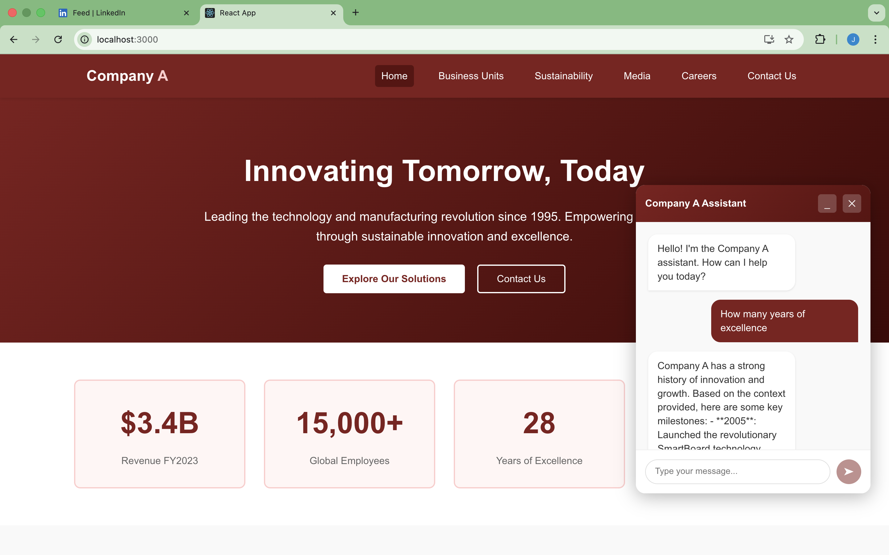
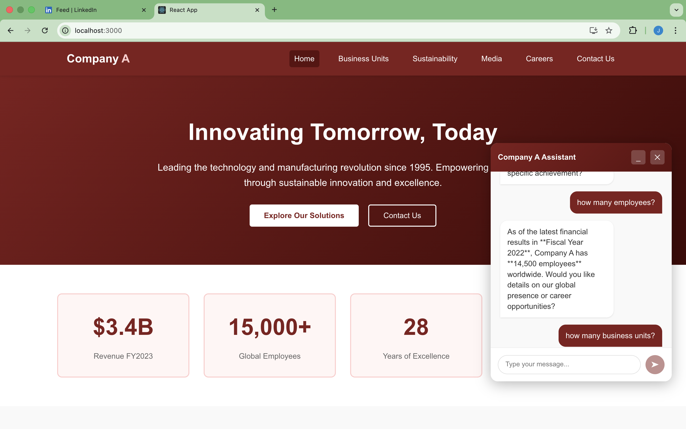

# 🚀 Company A: Full-Stack AI Chatbot Portfolio

<div align="center">


**A modern, AI-powered portfolio website featuring intelligent chatbot assistance through RAG architecture**

[Features](#-key-features) • [Demo](#-demo) • [Installation](#-installation) • [Usage](#-usage) • [Architecture](#-architecture)

</div>

---

## 📖 About

This project showcases a **production-ready full-stack application** combining modern web development with cutting-edge AI technology. It features a professional corporate portfolio website enhanced with an intelligent chatbot assistant that can answer questions about the company using Retrieval-Augmented Generation (RAG).

### What Makes This Special?

- 🤖 **Smart AI Assistant** - Leverages Mistral-7B LLM to provide accurate, context-aware responses
- 🔍 **Vector Search** - Uses Pinecone for semantic search across company knowledge base
- ⚡ **Real-time Interaction** - FastAPI backend ensures lightning-fast responses
- 🎨 **Professional UI** - Custom-designed responsive interface with modern aesthetics

---

## 🎬 Demo

### Application Preview

<div align="center">


*Homepage with responsive design and navigation*

</div>

<div align="center">


*Intelligent AI chatbot providing contextual responses*

</div>

---

## 🌟 Key Features

### 🧠 Intelligent Chatbot
- Powered by **Mistral-7B** via OpenRouter API
- Understands natural language queries about company information
- Provides contextual, accurate responses using RAG architecture

### 📊 Vector-Based Knowledge Retrieval
- **Pinecone** vector database for semantic search
- Embedding model: `all-MiniLM-L6-v2` (384 dimensions)
- Retrieves relevant company data: History, Financials, Leadership, Products

### 🎨 Modern Frontend
- Built with **React** for smooth, interactive user experience
- Fully responsive design optimized for all devices
- Professional maroon & white color scheme
- Floating chatbot widget for easy access

### 🔗 Multi-Page Navigation
- **Home** - Company overview and mission
- **Business Units** - Product and service offerings
- **Sustainability** - Environmental initiatives
- **Media** - News and press releases
- **Careers** - Job opportunities
- **Contact** - Get in touch

---

## 🏗️ Architecture

```
┌─────────────────────────────────────────────────────────────┐
│                         Frontend (React)                     │
│  - User Interface                                            │
│  - Chatbot Widget                                            │
│  - Multi-page Navigation                                     │
└──────────────────────┬──────────────────────────────────────┘
                       │ HTTP/REST API
┌──────────────────────▼──────────────────────────────────────┐
│                     Backend (FastAPI)                        │
│  - Query Processing                                          │
│  - Vector Search Logic                                       │
│  - LLM Integration                                           │
└─────────┬────────────────────────────┬──────────────────────┘
          │                            │
          │ Embeddings                 │ LLM Requests
          │                            │
┌─────────▼──────────┐       ┌────────▼──────────┐
│  Pinecone Vector   │       │   OpenRouter      │
│     Database       │       │  (Mistral-7B)     │
└────────────────────┘       └───────────────────┘
```

---

## 📂 Project Structure

```
company-a-fullstack/
├── backend/                    # FastAPI Backend
│   ├── main.py                 # API server & endpoints
│   ├── preprocess_data.py      # Data embedding & Pinecone upload
│   ├── company_data.json       # Knowledge base (company info)
│   ├── .env                    # Environment variables (API keys)
│   └── requirements.txt        # Python dependencies
│
├── company-a-website/          # React Frontend
│   ├── public/
│   │   └── index.html
│   ├── src/
│   │   ├── components/
│   │   │   ├── Navbar.js       # Navigation component
│   │   │   ├── Footer.js       # Footer component
│   │   │   └── Chatbot.js      # AI chatbot widget
│   │   ├── pages/
│   │   │   ├── Home.js
│   │   │   ├── BusinessUnits.js
│   │   │   ├── Sustainability.js
│   │   │   ├── Media.js
│   │   │   ├── Careers.js
│   │   │   └── Contact.js
│   │   ├── App.js              # Main React component
│   │   └── App.css             # Global styles
│   ├── package.json
│   └── README.md
│
└── screenshots/                # Demo images
    ├── image1.png
    └── image2.png
```

---

## 🚀 Installation

### Prerequisites

- **Node.js** (v14 or higher)
- **Python** (v3.8 or higher)
- **Pinecone Account** ([Sign up here](https://www.pinecone.io/))
- **OpenRouter API Key** ([Get one here](https://openrouter.ai/))

### Step 1: Clone the Repository

```bash
git clone https://github.com/yourusername/company-a-fullstack.git
cd company-a-fullstack
```

### Step 2: Backend Setup

#### 2.1 Navigate to Backend Directory

```bash
cd backend
```

#### 2.2 Create Virtual Environment

```bash
python -m venv venv

# Activate (Mac/Linux)
source venv/bin/activate

# Activate (Windows)
venv\Scripts\activate
```

#### 2.3 Install Dependencies

```bash
pip install fastapi uvicorn python-dotenv sentence-transformers pinecone-client requests pydantic
```

#### 2.4 Configure Environment Variables

Create a `.env` file in the `backend/` directory:

```env
PINECONE_API_KEY=your_pinecone_api_key_here
PINECONE_INDEX_NAME=company-a-chatbot
OPENROUTER_API_KEY=your_openrouter_api_key_here
```

> ⚠️ **Important**: Make sure your Pinecone index dimension is set to **384** to match the embedding model.

#### 2.5 Upload Knowledge Base to Pinecone

```bash
python preprocess_data.py
```

This script will:
- Load `company_data.json`
- Generate embeddings using `all-MiniLM-L6-v2`
- Upload vectors to your Pinecone index

### Step 3: Frontend Setup

#### 3.1 Navigate to Frontend Directory

```bash
cd ../company-a-website
```

#### 3.2 Install Dependencies

```bash
npm install
npm install axios
```

#### 3.3 Start Development Server

```bash
npm start
```

The application will open at `http://localhost:3000`

### Step 4: Start Backend Server

In a **separate terminal**:

```bash
cd backend
source venv/bin/activate  # or venv\Scripts\activate on Windows
uvicorn main:app --reload
```

Backend API will run at `http://localhost:8000`

---

## 💻 Usage

1. **Access the Website**: Open `http://localhost:3000` in your browser
2. **Navigate Pages**: Use the navigation bar to explore different sections
3. **Chat with AI**: Click the 💬 floating button in the bottom-right corner
4. **Ask Questions**: Type queries like:
   - "What does Company A do?"
   - "Tell me about your sustainability initiatives"
   - "Who are the key leaders?"
   - "What products do you offer?"

---

## 🔧 API Endpoints

### `POST /chat`

Send a message to the chatbot and receive an AI-generated response.

**Request Body:**
```json
{
  "message": "What is Company A's mission?"
}
```

**Response:**
```json
{
  "response": "Company A's mission is to..."
}
```

---

## 🐛 Troubleshooting

### 500 Internal Server Error

**Cause**: Pinecone index dimension mismatch

**Solution**: Ensure your Pinecone index is configured with **384 dimensions**

```python
# When creating index in Pinecone dashboard:
dimension = 384
metric = "cosine"
```

### CORS Error

**Cause**: Backend not allowing frontend origin

**Solution**: Verify CORS settings in `backend/main.py`:

```python
app.add_middleware(
    CORSMiddleware,
    allow_origins=["http://localhost:3000"],
    allow_credentials=True,
    allow_methods=["*"],
    allow_headers=["*"],
)
```

### Chatbot Not Responding

**Cause**: Backend server not running or wrong port

**Solution**: 
- Ensure backend is running on port 8000
- Check browser console for error messages
- Verify API keys in `.env` file

### Babel/Syntax Error

**Cause**: Duplicate React imports or JSX syntax issues

**Solution**: Check your component files for duplicate imports:

```javascript
// ❌ Wrong - duplicate imports
import React from 'react';
import React from 'react';

// ✅ Correct
import React from 'react';
```

---

## 🛣️ Roadmap

- [ ] Add user authentication
- [ ] Implement chat history persistence
- [ ] Add more knowledge base categories
- [ ] Deploy to cloud platform (AWS/GCP/Azure)
- [ ] Add multilingual support
- [ ] Implement voice chat functionality

---

## 🤝 Contributing

Contributions are welcome! Please feel free to submit a Pull Request.

1. Fork the repository
2. Create your feature branch (`git checkout -b feature/AmazingFeature`)
3. Commit your changes (`git commit -m 'Add some AmazingFeature'`)
4. Push to the branch (`git push origin feature/AmazingFeature`)
5. Open a Pull Request

---

## 📄 License

This project is licensed under the MIT License - see the [LICENSE](LICENSE) file for details.

---

## 👨‍💻 Author

**Your Name**
- GitHub: [@yourusername](https://github.com/yourusername)
- LinkedIn: [Your Profile](https://linkedin.com/in/yourprofile)

---

## 🙏 Acknowledgments

- [Mistral AI](https://mistral.ai/) for the powerful LLM
- [Pinecone](https://www.pinecone.io/) for vector database services
- [OpenRouter](https://openrouter.ai/) for API gateway
- [FastAPI](https://fastapi.tiangolo.com/) for the excellent framework
- [React](https://react.dev/) for the frontend library

---

<div align="center">

**⭐ Star this repo if you find it helpful!**

Made with ❤️ and ☕

</div>
